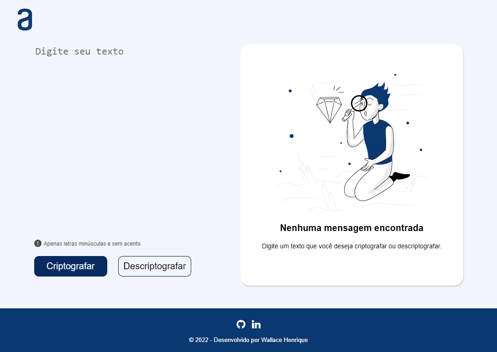

# Codificador e Decodificador de Texto - Alura - ONE

<!--ts-->
   * [Sobre](#sobre)
   * [Regras de codificação](#regras)
   * [Requisitos](#requisitos)
   * [Extras](#extras)
   * [Funcionalidades](#features)
   * [Demonstração](#demo)
<!--te-->

<h3 align="center">
  
  
</h3>

<h3 name="sobre">Sobre</h3>
Primeiro desafio proposto durante o programa ONE (Oracle Next Education), cujo objetivo é criptografar textos conforme o padrão a seguir.

<h3 name="regras">Regras de codificação</h3>
<ul>
  <li>A letra <code>e</code> é convertida para <code>enter</code>;</li>
  <li>A letra <code>i</code> é convertida para <code>imes</code>;</li>
  <li>A letra <code>a</code> é convertida para <code>ai</code>;</li>
  <li>A letra <code>o</code> é convertida para <code>ober</code>;</li>
  <li>A letra <code>u</code> é convertida para <code>ufat</code>.</li>
</ul>

<h3 name="requisitos">Requisitos:</h3>
<ul>
  <li>Deve funcionar apenas com letras minúsculas.</li>
  <li>Não devem ser utilizados letras com acentos nem caracteres especiais.</li>
  <li>Deve ser possível converter uma palavra para a versão criptografada e também retornar uma palavra criptografada para a versão original</li>
</ul>

<h3 name="extras">Extras:</h3>
<ul>
  <li>Um botão que copie o texto criptografado/descriptografado para a área de transferência - ou seja, que tenha a mesma funcionalidade do <kbd>CTRL</kbd> + <kbd>C</kbd> ou da opção "copiar" do menu dos aplicativos.</li>
</ul>

### Funcionalidades 
- [x] Codificação de texto
- [x] Decodificação de texto
- [x] Botão para copiar o resultado
- [x] Responsividade

<h3 name="demo">Demonstração:</h3>
<ul>
  <li>Teste: <a href="https://whcardoso.github.io/decodificador-de-texto-challenge-alura-one/" target="_blank">Clique aqui para testar</a>.</li>
</ul>

<h3 name="autor">Autor</h3>

Feito com ❤️ por Wallace Henrique

 
